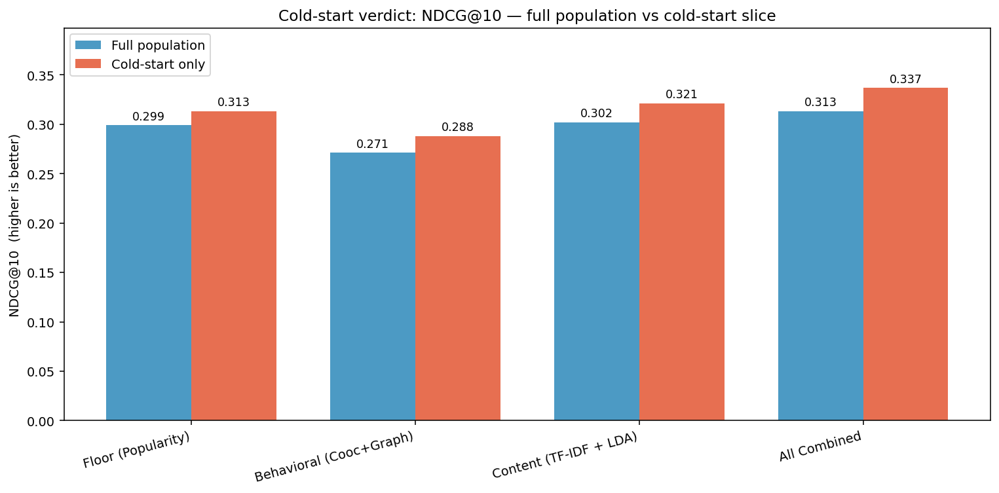

# Serving the Invisible Third
### Can content signals reach the users your algorithm can't see?

**CSCE 676 - Data Mining and Analysis | Spring 2026 | Texas A&M University**   
**Author:** Akash Moses Guttedar - UIN: 535005841

---

 **Project video:** *[2-min video](https://youtu.be/0d1_L-MefcQ)*  
 **Start here:** [`main_notebook.ipynb`](main_notebook.ipynb)

---

## Overview

News recommendation breaks for **1 in 3 users** — those who visit only once, giving the algorithm a single shot with no repeat signal to learn from. Behavioral systems have nothing to refine for these ghost users, so they guess or fall back to popularity.

This project runs a controlled head-to-head experiment on Microsoft's MIND-small dataset (50K users · 156K impressions) to test whether **content + topic signals** can outperform behavioral signals for these single-visit cold-start users. Four signal sources — popularity, FP-Growth co-occurrence, co-click graph features, and TF-IDF + LDA topic features — are evaluated under the same logistic regression ranker on both the full population and the cold-start slice.

**Result:** Content + topic signals outperform behavioral signals on cold-start users on position-aware metrics — winning MRR by 13.8% and NDCG@10 by 11.5%.

---

## Research Questions

**Main RQ:**
> For single-visit users with no repeat behavioral signal, do content + topic signals outperform behavioral signals?

**Sub-questions (exploratory paths to the main RQ):**
- **RQ1:** Can co-occurrence patterns within impressions improve recommendation relevance? *(FP-Growth — course)*
- **RQ2:** Do co-click graph relationships improve quality beyond co-occurrence alone? *(Graph mining — course)*
- **RQ3:** Can content + latent topic signals improve quality for limited-history users? *(TF-IDF + LDA — course + external)*

---

## Results Summary

| Metric | Content | Behavioral | Winner |
|---|---|---|---|
| AUC | 0.651 | **0.655** | Behavioral (+0.004) |
| MRR | **0.282** | 0.248 | Content (+13.8%) |
| NDCG@10 | **0.321** | 0.288 | Content (+11.5%) |
| HR@10 | **0.601** | 0.572 | Content (+5.1%) |

*Evaluated on cold-start slice (3,357 impressions, 16,383 single-visit users — 32.8% of all users).*



---

## Data

**Dataset:** MIND-small (Wu et al., ACL 2020) — 50,000 users, 51,282 articles, 156,965 impressions.

**Files used:** `behaviors.tsv` and `news.tsv` from `MINDsmall_train.zip`.

**Access:** Download `MINDsmall_train.zip` from [msnews.github.io](https://msnews.github.io/) and upload to Google Drive at:
```
MyDrive/Data Mining/Project/Datasets/MINDsmall_train.zip
```
The notebook mounts Drive and extracts automatically on first run. Data files are not committed to this repo.

---

## How to Reproduce

This project was built and tested in **Google Colab** with a High-RAM CPU runtime.

1. Upload `MINDsmall_train.zip` to Google Drive at the path above.
2. Open [`main_notebook.ipynb`](main_notebook.ipynb) in Colab.
3. Click **Runtime → Run all**.

The first cell clones this repo so the notebook can import from `src/`. The data cell mounts Drive and extracts the zip. Everything runs end-to-end without manual intervention.

**Runtime:** ~20–30 minutes on Colab High-RAM CPU.

---

## Key Dependencies

| Package | Version |
|---|---|
| Python | 3.12.13 |
| pandas | 2.2.2 |
| numpy | 2.0.2 |
| scikit-learn | 1.6.1 |
| mlxtend | 0.23.4 |
| networkx | 3.6.1 |
| matplotlib | 3.10.0 |
| scipy | 1.16.3 |

Full package list: [`requirements.txt`](requirements.txt)

---

## Repo Structure

```
news-rec-atlas/
├── main_notebook.ipynb                         <- Start here — the full curated story
├── requirements.txt                            <- Full Colab environment (pip freeze)
├── .gitignore
├── src/
│   ├── data_loader.py                           <- MIND loading, Drive setup, impression parsing
│   ├── features.py                              <- Popularity, FP-Growth, graph, TF-IDF+LDA features
│   ├── ranker.py                                <- Logistic regression, AUC/MRR/NDCG@10/HR@10
│   └── utils.py                                 <- Chronological split, cold-start mask, seeding
├── checkpoints/
│   ├── checkpoint_1.ipynb                       <- Checkpoint-1 : EDA and dataset selection
│   └── checkpoint_2.ipynb                       <- Checkpoint-2 : RQ formation and feasibility checks
├── data/
│   └── README.md                                <- download instructions (data not committed)
└── assets/
    ├── conclusion_figure.png                    <- Cold-start verdict: full vs cold-start NDCG@10
    ├── results_full.png                         <- Full-population scoreboard
    ├── coldstart_slice.png                      <- History-length distribution
    └── graph_degree.png                         <- Co-click graph degree distribution
```

---

## References

- Wu, F. et al. (2020). *MIND: A Large-scale Dataset for News Recommendation.* ACL 2020.
- Han, J., Pei, J., & Yin, Y. (2000). *Mining frequent patterns without candidate generation.* SIGMOD.
- Blei, D. M., Ng, A. Y., & Jordan, M. I. (2003). *Latent Dirichlet Allocation.* JMLR.
- Leskovec, J., Rajaraman, A., & Ullman, J. D. (2020). *Mining of Massive Datasets* (3rd ed.). Cambridge University Press.